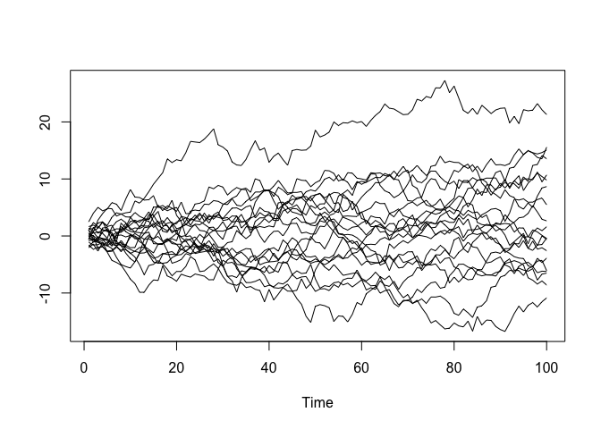
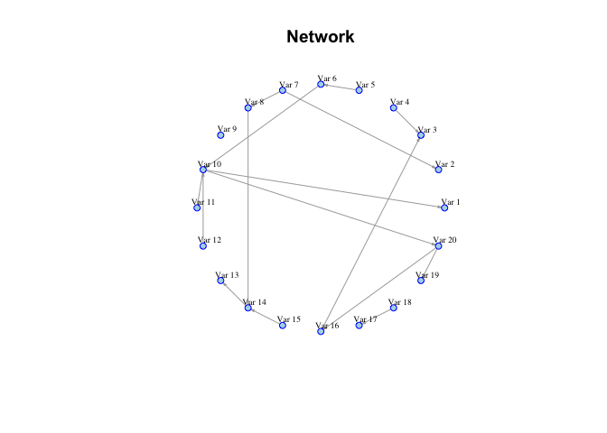
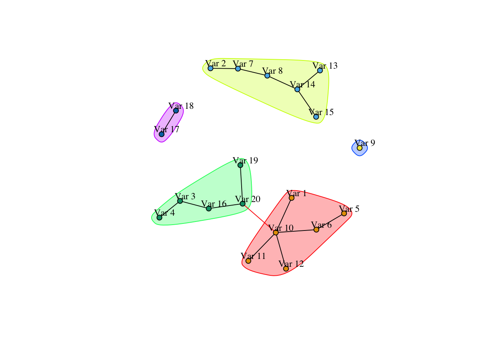

<!-- README.md is generated from README.Rmd. Please edit that file -->

# HDGCvar

<!-- badges: start -->

[](https://cran.r-project.org/package=HDGCvar)
[](https://cran.r-project.org/package=HDGCvar)
[](https://opensource.org/licenses/MIT)
<!-- badges: end -->

`HDGCvar` allows for testing Granger causality in High Dimensional
Vector Autoregressive Models (VARs). Granger causality can be tested
between time series that are stationary (`HDGC_VAR_I0`), non stationary
(unit root), cointegrated, or all the above (`HDGC_VAR`). Bivariate as
well as multivariate (i.e. blocks) causality can be considered by
specifying the name(s) of the variable(s) of interest in `GCpair` (or
`GCpairs`) and networks can be plotted to visualize the causal structure
among several variables using `Plot_GC_all`.

A specific part of `HDGCvar` is dedicated to Realized Volatilities (RV),
thus using the Heterogeneous VAR (HVARs). It gives the possibiity of
building RV spillover networks (`HDGC_HVAR_all`) as well as conditioning
RV on Realized Correlations (`HDGC_HVAR_RV_RCoV_all`).

## Installation

You can install the released version of HDGCvar from
[CRAN](https://CRAN.R-project.org) with:

``` r
install.packages("HDGCvar")
```

And the development version from [GitHub](https://github.com/) with:

``` r
# install.packages("devtools")
devtools::install_github("Marga8/HDGCvar")
```

All the functions in `HDGCvar` are based on the following two papers:

1.  A. Hecq, L. Margaritella, S.Smeekes, “Granger Causality Testing in
    High Dimensional VARs: a Post Double Selection Procedure”(2019,
    <https://arxiv.org/abs/1902.10991> )  
2.  A. Hecq, L. Margaritella, S.Smeekes, “Inference in Non Stationary
    High Dimensional VARs” (2020, check the latest version at
    <https://sites.google.com/view/luca-margaritella> ).

## Details

If the addition of variable X to the given information set Ω alters the
conditional distribution of another variable Y, and both X and Ω are
observed prior to Y, then X improves predictability of Y, and is said to
*Granger cause* Y with respect to Ω.

Statistically assessing the predictability among two (or blocks of) time
series turns out to be a fundamental concept in modern time series
analysis. Its applications range over from macroeconomics, finance,
network theory and even the neurosciences.

With the increased availability of larger datasets, these causality
concepts have been extended to the high-dimensional setting where they
can benefit from the inclusion of many more series within the available
information set Ω. Note how including as much information as possible is
particularly tending to the original idea of Granger (1969) who
envisioned Ω to be “all the information in the universe”, in order to
avoid spurious causality.

Conditioning on so many variables comes at a cost, i.e. quickly running
into problems of high-dimensionality: sky-rocketing variance,
overfitting and in general invalidity of standard statistical
techniques.

A. Hecq, L. Margaritella, S.Smeekes (2019), designed a Granger causality
LM test for high-dimensional stationary vector autoregressive models
(VAR) which combine dimensionality reduction techniques based on
penalized regressions such as the lasso of Tibshirani (1996), with the
post-double-selection procedure of Belloni et al. (2011) to select the
set of relevant covariates in the system. The double selection step
allows to substantially reduce the omitted variable bias and thereby
allowing for valid post-selection inference on the parameters.

*If you are sure that your time series are stationary*, you can go ahead
and use one of the following functions from `HDGCvar`:

1.  `HDGC_VAR_I0` which tests for Granger causality in High Dimensional
    Stationary VARs  
2.  `HDGC_VAR_multiple_I0` or `HDGC_VAR_multiple_pairs_I0` which test
    multiple combinations Granger causality in High Dimensional
    Stationary VARs  
3.  `HDGC_VAR_all_I0` which allows you to test all the bivariate
    combinations in you dataset and hence to build a Granger causality
    network.

All these functions ask you as inputs:

  - `GCpair` or `GCpairs`, a list object explicitly containing the
    Granger caused variables “GCto” and the Granger causing “GCfrom”.  
  - `data` , the dataset containing as columns all the time series you
    are modeling.  
  - `p = 1`, the lag-length of the VAR. Unless you want to explicitly
    impose it, you can use `HDGCvar::lags_upbound_BIC()` which estimates
    an empirical upper bound for the lag-length using Bayesian
    Information Criteria (for details see Hecq et al. 2019).  
  - `bound = 0.5 * nrow(data)`, this is meant for applying a lower bound
    on the penalty parameter of the lasso. In simple words it means you
    are telling the lasso, in each equations it estimates, to please
    stop when it has reached an amount of selected (i.e. non-zero
    coefficient) variables corresponding to \(50\%\) of the sample size.
    This is innocuous in small systems but quite important for systems
    where the number of variables per-equation (i.e. lags included) is
    larger than the sample size (for details see Hecq et al. 2019).  
  - `parallel = FALSE`, put equal to TRUE for parallel computing.  
  - `n_cores = NULL`, number of cores to use in parallel computing,
    default is all but one.

A. Hecq, L. Margaritella, S.Smeekes (2020) extended the
Post-double-selection Granger causality LM test of Hecq et al. (2019) to
the case in which your system might contain time series integrated of
arbitrary orders and possibly even cointegrated. To accomplish this is
necessary to simply augment the lags of the variables of interest by the
maximum order of integration we suspect the series having. This allows
to completely avoid any biased pre-test of unit-root or cointegration
and directly perform high-dimensional inference on the desired
parameters.

*Therefore: if you are NOT sure whether your time series are stationary,
non-stationary, cointegrated, or an appropriate mix of the above or you
do not trust the biased unit root and cointegration tests out there*, we
got you covered\! you can go ahead and use one of the following
functions from `HDGCvar`:

1.  `HDGC_VAR` which tests for Granger causality in High Dimensional
    Stationary/Non-Stationary/cointegrated or a mix of the above, VARs  
2.  `HDGC_VAR_multiple` or `HDGC_VAR_multiple_pairs` which test multiple
    combinations Granger causality in High Dimensional
    Stationary/Non-Stationary/cointegrated or a mix of the above, VARs  
3.  `HDGC_VAR_all` which allows you to test all the bivariate
    combinations in you dataset and hence to build a Granger causality
    network.

All these functions ask you the same inputs as reported above for
`HDGC_VAR_I0` with the addition of the following:

  - `d=2`, is the augmentation needed to handle the potentially
    non-stationary time series. It should correspond to the maximum
    suspected order of integration of your time series. This might sound
    vague but think about it: in economics I have never seen a variable
    integrated of order three. Therefore, unless you are absolutely sure
    that your time series are at most integrated of order one or that
    for whatever unlikely reason you have at least one variable
    integrated of order three, I would recommend to put `d=2`.

Back to A. Hecq, L. Margaritella, S.Smeekes (2019), in their empirical
application they considered a specific case of stationary time series,
namely they investigate the volatility transmission in stock return
prices using the daily realized variances. These are very attractive
measures among practitioners and academics for modelling time varying
volatilities and monitoring financial risk. Given the time series of
realized volatilities, a multivariate version of the heterogeneous
autoregressive model (HVAR) of Corsi (2009) is employed to model their
joint behavior.

*Therefore: if you are interested in testing Granger causality among
realized volatilities and potentially build volatility spillover
networks* you should use one of the following function from `HDGCvar`:

1.  `HDGC_HVAR` which tests for Granger causality in High Dimensional
    stationary HVARs.  
2.  `HDGC_HVAR_multiple` or `HDGC_VAR_multiple_pairs` which test
    multiple combinations Granger causality in High Dimensional
    stationary HVARs.
3.  `HDGC_HVAR_all` which allows you to test all the bivariate
    combinations in you dataset and hence to build a Granger causality
    network.

All these functions ask you the same inputs as reported above for
`HDGC_VAR_I0` with the inclusion of `log=TRUE` to log-transform the
series (recommended) and the exclusion of the lag-length parameter `p`
as in a HVAR this is already pre-specified to be equal to 3, namely the
daily, weekly, monthly aggregates of realized volatilities (for details
see Corsi (2009) and Hecq et al. (2019)).

Note: to account for the potential heteroskedasticity in the data, all
these functions returns the Asymptotic χ\(^2\) version of the LM test
(“Asymp”), the small sample correction F tests (“FS\_cor”) and the
heteroskedasticity-robust Asymptotic χ\(^2\) (Asymp\_Robust).

It is not all: if you whish to condition your volatility spillover
network on realized correlations you can also do so by using one of the
following function from `HDGCvar`:

1.  `HDGC_HVAR_RV_RCoV_all`, compute Network of Realized Volatilities
    conditional on the set of Realized Correlations  
2.  `HDGC_HVAR_RVCOV`, Test Granger causality for Realized Volatilities
    in High Dimensional Stationary Heterogeneous VARs conditioning on
    Realized Correlations  
3.  `HDGC_HVAR_multiple_RVCOV`, Test multiple combinations Granger
    causality for realized volatilities in High Dimensional Stationary
    HVARs

All these functions ask you the following inputs:

  - `realized_variances`, matrix of realized variances.  
  - `realized_covariances`, matrix of realized covariances.  
  - `fisher_transf=TRUE`, to Fisher-transform the realized correlations.
    It essentially calls the function `HDGCvar::Realized_corr()` which
    calculates the realized correlations from the inputs
    `realized_variances` and `realized_covariances` and Fisher-transform
    them (for details see Hecq et al. (2019)).  
  - `log=TRUE`, to log-transform the volatility series (recommended).  
  - `bound = 0.5 * nrow(realized_variances)`, same as `bound = 0.5 *
    nrow(data)`, see `HDGC_VAR_I0`.
  - `parallel = FALSE`, put equal to TRUE for parallel computing.  
  - `n_cores = NULL`, number of cores to use in parallel computing,
    default is all but one.

In order to plot networks created via: `HDGC_VAR_all_I0`,
`HDGC_VAR_all`, `HDGC_HVAR_all`, `HDGC_HVAR_RV_RCoV_all` you can use the
function

  - `Plot_GC_all`

This function takes as inputs:  
\* `Comb`, stands for the result of one of the functions:
`HDGC_VAR_all_I0`, `HDGC_VAR_all`, `HDGC_HVAR_all`,
`HDGC_HVAR_RV_RCoV_all`  
\* `Stat_type="FS_cor"`, the default is “FS\_cor” namely the small
sample correction F test. Alternatively one can use “Asymp” for the
asymptotic χ\(^2\) test or “Asymp\_Robust” for the
heteroskedasticity-robust asymptotic χ\(^2\) test.  
\* `alpha=0.01`, the desired probability of type one error, default is
0.01.  
\* `multip_corr`, a list A list: first element is logical, if TRUE a
multiple testing correction using stats::p.adjust() is used. The second
element of the list define the p.adjust.method=c(“holm”, “hochberg”,
“hommel”, “bonferroni”, “BH”, “BY”,“fdr”, “none”)). If the second
element gets the name “APF\_FDR” then APFr::apf\_fdr which uses
empirical Bayes is called and a third and fourth elements in the
mutip\_corr list are required: gamm=c(,,) requires a min, max and step
length values to be set for the threshold on the p\_values,fdr.apf=c(,)
requires one or two values: either (NULL,value) or (value,NULL) if one
wants to have specified amount of average power (fdr) no matter fdr
(average power). If both (value,value) are given, the calculated
threshold will find the closest combination to both apf and fdr desired.
The last element of the list is logical: verbose=TRUE if one wants to
know how much apf/fdr the testing has.  
\* `...`, all parameters for the network plot: see example and igraph
documentation.  
\* `cluster`, a list: first element is logical, if TRUE a cluster plot
using igraph::cluster\_edge\_betweenness() is plotted. Other elements
are respectively: vertex.size, vertex.label.color,vertex.label.cex,
vertex.label.dist, edge.curved (see igraph for details).

## Examples

Here is a simulated examples which show you how to use some of the
features in `HDGCvar`.

``` r
library(HDGCvar)
library(igraph)
#> 
#> Attaching package: 'igraph'
#> The following objects are masked from 'package:stats':
#> 
#>     decompose, spectrum
#> The following object is masked from 'package:base':
#> 
#>     union

#First, let us simulate some time series
#The SimulVAR below simulates a (non-sparse) stationary VAR(1) with sample size T_ and number of variables g
SimulVAR=function(T_,g){
  coef1<-matrix(NA,nrow=g,ncol=g)
  for (i in 1:g) {
    for (j in 1:g) {
      coef1[i,j]<-((-1)^(abs(i-j)))*(0.4^(abs(i-j)+1))
    }
  }
  presample<-1
  T_new<-T_+presample
  eps1<-rnorm(ncol(coef1)*T_new,0,1)
  eps<-matrix(eps1,nrow=ncol(coef1))
  X <- matrix(nrow=ncol(coef1),ncol=T_new)
  X[,1] <- eps[,1]
  for (t in 2:T_new) {
    X[,t] <- (coef1)%*%X[,t-1]+eps[,t]
  }
  finseries<- X[,(1+presample):T_new]
  return(t(finseries))
}

#You can check the stationarity of the VAR(1) by simply observing:
g=20
coef<-matrix(NA,nrow=g,ncol=g)
  for (i in 1:g) {
    for (j in 1:g) {
      coef[i,j]<-((-1)^(abs(i-j)))*(0.4^(abs(i-j)+1))
    }
  }
max(eigen(coef)$values) #<1
#> [1] 0.9132571

#Let us fix some seed and simulate 20 non-stationary time series with sample size 100 from a VAR(2) by taking the inverse difference of the stationary series simulated
set.seed(123)
dataset_I0<-as.matrix(SimulVAR(100,20))
dataset<-as.matrix(diffinv(dataset_I0))
colnames(dataset)<-c(paste(rep("Var",20),1:20))

#Let us plot the time series to get a feeling of what kind of data we are dealing with
ts.plot(dataset)
```



``` r

#Select the lag-length of the VAR using HDGCvar::lags_upbound_BIC
selected_lag<-lags_upbound_BIC(dataset,p_max=10)
print(selected_lag)
#> [1] 2
#Note: hooray! the selected lag is p=2 which it is correct given our simulated data! Of course in practice we could not know this.

#Suppose we are interested in testing whether variable name "Var5" Granger-causes variable name "Var1" given all other variables in your dataset.
interest_variables=list("GCto"="Var 1","GCfrom"="Var 5")

#By visual diagnostics on the series in our dataset from the previous plot we definitely have some time series with unit roots and probably cointegration. Actually: we definitely know this as we created the process in such a way that all the variables have a unit root, in practice obviously this would not be the case.

#However, the nice feature of HDGCvar is that you can completely avoid any pre-tests of integration/cointegration of your series. As we do not know whether the maximum order of integration of our time series is one or two, the safe choice is to let d=2 and simply run

HDGC_VAR(GCpair=interest_variables, data=dataset, p = selected_lag, d = 2, bound = 0.5 * nrow(dataset),
                     parallel = T, n_cores = NULL) 
#> $tests
#>             Asymp    FS_cor
#> LM_stat 2.1901403 0.8547127
#> p_value 0.3345161 0.4295616
#> 
#> $selections
#>  Var 1 l1  Var 2 l1  Var 3 l1  Var 4 l1  Var 6 l1  Var 7 l1  Var 8 l1  Var 9 l1 
#>      TRUE      TRUE      TRUE      TRUE      TRUE     FALSE      TRUE      TRUE 
#> Var 10 l1 Var 11 l1 Var 12 l1 Var 13 l1 Var 14 l1 Var 15 l1 Var 16 l1 Var 17 l1 
#>     FALSE     FALSE     FALSE      TRUE     FALSE     FALSE      TRUE     FALSE 
#> Var 18 l1 Var 19 l1 Var 20 l1  Var 1 l2  Var 2 l2  Var 3 l2  Var 4 l2  Var 6 l2 
#>     FALSE     FALSE      TRUE      TRUE      TRUE     FALSE     FALSE      TRUE 
#>  Var 7 l2  Var 8 l2  Var 9 l2 Var 10 l2 Var 11 l2 Var 12 l2 Var 13 l2 Var 14 l2 
#>     FALSE      TRUE     FALSE     FALSE     FALSE     FALSE     FALSE     FALSE 
#> Var 15 l2 Var 16 l2 Var 17 l2 Var 18 l2 Var 19 l2 Var 20 l2 
#>      TRUE      TRUE      TRUE     FALSE     FALSE     FALSE

#Now, suppose we are interested in testing multiple Granger causality relations
mult_interest_variables<-list(list("GCto"="Var 7", "GCfrom"="Var 19"),list("GCto"="Var 4", "GCfrom"="Var 16"))
HDGC_VAR_multiple(dataset, GCpairs=mult_interest_variables, p= selected_lag, d=2, bound = 0.5 * nrow(dataset),
                     parallel = T, n_cores = NULL)
#> $tests
#> , , GCtests = Var 19 -> Var 7
#> 
#>          type
#> stat          Asymp    FS_cor
#>   LM_stat 0.6076704 0.2301010
#>   p_value 0.7379825 0.7950274
#> 
#> , , GCtests = Var 16 -> Var 4
#> 
#>          type
#> stat          Asymp    FS_cor
#>   LM_stat 0.5822482 0.2355135
#>   p_value 0.7474229 0.7907248
#> 
#> 
#> $selections
#> $selections$`Var 19 -> Var 7`
#>  Var 1 l1  Var 2 l1  Var 3 l1  Var 4 l1  Var 5 l1  Var 6 l1  Var 7 l1  Var 8 l1 
#>     FALSE      TRUE     FALSE      TRUE     FALSE     FALSE      TRUE      TRUE 
#>  Var 9 l1 Var 10 l1 Var 11 l1 Var 12 l1 Var 13 l1 Var 14 l1 Var 15 l1 Var 16 l1 
#>     FALSE     FALSE      TRUE      TRUE     FALSE     FALSE      TRUE      TRUE 
#> Var 17 l1 Var 18 l1 Var 20 l1  Var 1 l2  Var 2 l2  Var 3 l2  Var 4 l2  Var 5 l2 
#>     FALSE      TRUE      TRUE     FALSE     FALSE     FALSE      TRUE      TRUE 
#>  Var 6 l2  Var 7 l2  Var 8 l2  Var 9 l2 Var 10 l2 Var 11 l2 Var 12 l2 Var 13 l2 
#>      TRUE      TRUE     FALSE     FALSE     FALSE     FALSE     FALSE     FALSE 
#> Var 14 l2 Var 15 l2 Var 16 l2 Var 17 l2 Var 18 l2 Var 20 l2 
#>     FALSE      TRUE      TRUE     FALSE      TRUE      TRUE 
#> 
#> $selections$`Var 16 -> Var 4`
#>  Var 1 l1  Var 2 l1  Var 3 l1  Var 4 l1  Var 5 l1  Var 6 l1  Var 7 l1  Var 8 l1 
#>     FALSE      TRUE     FALSE      TRUE      TRUE      TRUE     FALSE      TRUE 
#>  Var 9 l1 Var 10 l1 Var 11 l1 Var 12 l1 Var 13 l1 Var 14 l1 Var 15 l1 Var 17 l1 
#>     FALSE      TRUE     FALSE     FALSE     FALSE      TRUE      TRUE     FALSE 
#> Var 18 l1 Var 19 l1 Var 20 l1  Var 1 l2  Var 2 l2  Var 3 l2  Var 4 l2  Var 5 l2 
#>     FALSE     FALSE     FALSE     FALSE     FALSE     FALSE      TRUE     FALSE 
#>  Var 6 l2  Var 7 l2  Var 8 l2  Var 9 l2 Var 10 l2 Var 11 l2 Var 12 l2 Var 13 l2 
#>     FALSE     FALSE     FALSE     FALSE     FALSE      TRUE      TRUE      TRUE 
#> Var 14 l2 Var 15 l2 Var 17 l2 Var 18 l2 Var 19 l2 Var 20 l2 
#>     FALSE      TRUE     FALSE     FALSE     FALSE     FALSE


#Let us now estimate the full network of causality among the 20 series in dataset
network<-HDGC_VAR_all(dataset, p = selected_lag, d = 2, bound = 0.5 * nrow(dataset), 
                         parallel = TRUE, n_cores = NULL)


#Now let us plot the estimated network.
#You can even do clustering of the connected series using the option cluster=list(T,5,"black",0.8,1,0).
#This uses Newman-Girvan (2002) algorithm based on edge-betweenness.
Plot_GC_all(network, Stat_type="FS_cor",alpha=0.01, multip_corr=list(F),directed=T, layout=layout.circle, main="Network",edge.arrow.size=.2,vertex.size=5, vertex.color=c("lightblue"), vertex.frame.color="blue",vertex.label.size=2,vertex.label.color="black",vertex.label.cex=0.6, vertex.label.dist=1, edge.curved=0,cluster=list(T,5,"black",0.8,1,0)) 
```


